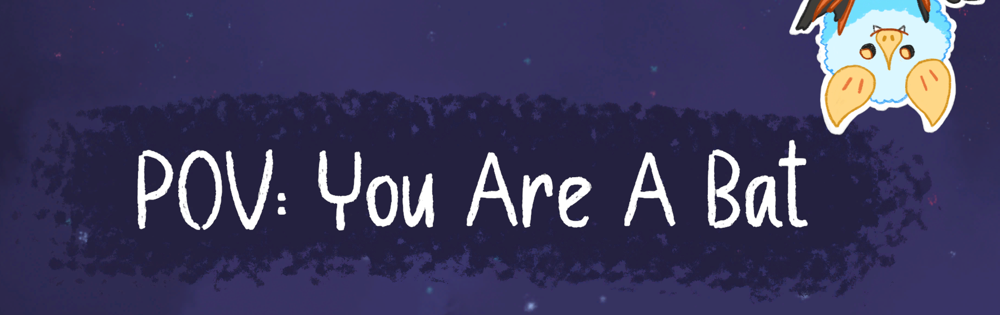

## About the Project
POV: You Are a Bat, is a single-player puzzle-based dating sim. Explore the world and meet a creative cast of characters who you'll want to shower in gifts!
You can download the executable to try it yourself at [link to POV: You Are a Bat on Itch.io](https://spagazani.itch.io/pov-you-are-a-bat).

This project was completed as part the CISC 226 at Queen's University. We were tasked with desiging a game with a novel mechanic or game experience goal. 
After brainstorming, we landed on the concept of echolocation, a key mechanic to solving all problems and easy navigation with the drawback
that it alerts foes to the player's location. With it, we ideated a colorful cast of characters with whom we quickly fell in love, cementing
our game as a story-based, puzzle visual novel.

The development process occured over a short 12 week period. It followed practices of game design, beginning with brainstorming followed 
by playtesting on an early prototype, culminating in the final completed game you see today. We are very proud of the final result, which 
drew enough attention to get featured on the Queen's Creative Computing Showcase of April 2024, and hope you enjoy it as well!

The game was created using the Unity engine and C#, with many othertools used to make custom assets. 
Credit to myself, Claire Whelan, Sophia Pagazani and Aniss Hamouda for development efforts. 
